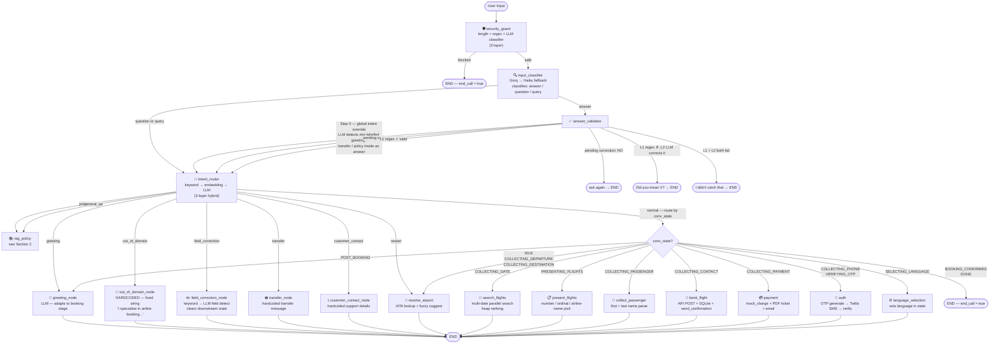
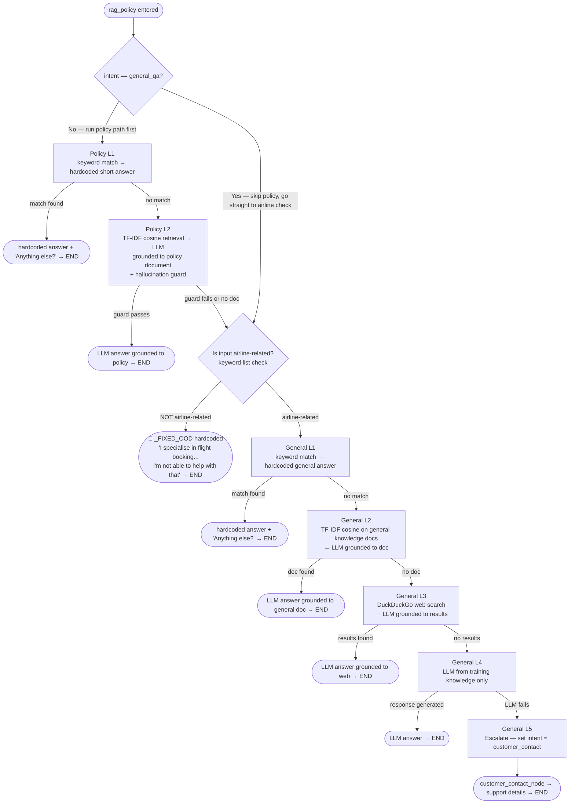
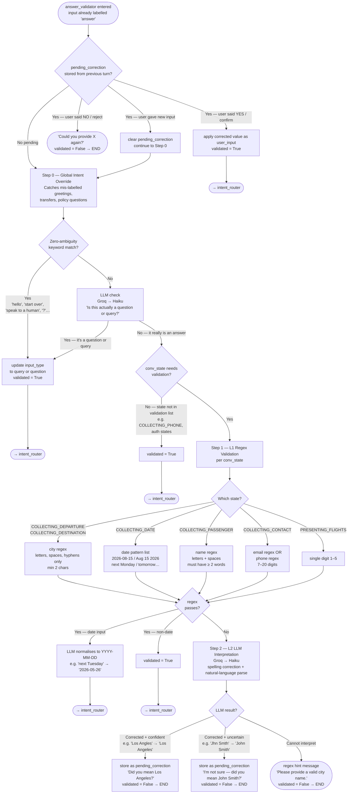

# Phoenix Air — Agent Flow

---

## 1. Top-Level Pipeline

---

## 2. rag_policy — Internal Layers

Handles both `policy` intent and `general_qa` intent.

---

## 3. answer_validator — Internal Steps

Runs only when `input_classifier` returns `answer`.

---

## 4. Conv State → Node Routing (intent = normal)

| Conv State | Node |
|---|---|
| `IDLE` | resolve_airport |
| `SELECTING_LANGUAGE` | language_selection |
| `COLLECTING_PHONE` | auth |
| `VERIFYING_OTP` | auth |
| `COLLECTING_DEPARTURE` | resolve_airport |
| `COLLECTING_DESTINATION` | resolve_airport |
| `COLLECTING_DATE` | search_flights |
| `PRESENTING_FLIGHTS` | present_flights |
| `COLLECTING_PASSENGER` | collect_passenger |
| `COLLECTING_CONTACT` | book_flight |
| `COLLECTING_PAYMENT` | payment |
| `POST_BOOKING` | greeting |
| `BOOKING_CONFIRMED` | end_node |
| `DONE` | end_node |

---

## 5. Response Type Labels

| Label | Meaning |
|---|---|
| `hardcoded` | Fixed string, no LLM involved |
| `llm` | LLM-generated response |
| `fallback` | Timeout or error fallback message |

---

## 6. LLM Provider Priority

Every LLM call in the system tries **Groq (Llama 3.1 8B)** first (~100ms), then falls back to **Claude Haiku** (~600ms) if Groq is unavailable or errors. The `GROQ_API_KEY` env var controls this — if blank, all calls go directly to Haiku.
